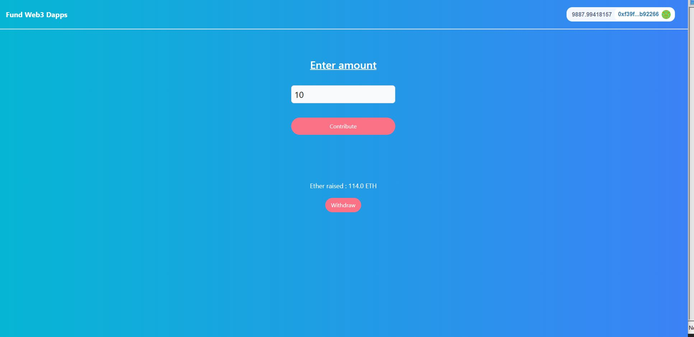

## Getting Started

Run development server:

```bash
yarn
yarn run dev
```

Open [http://localhost:3000](http://localhost:3000) with your browser to see the result.

Sample rinkeby contract is configured in /constants/contractAddressess.json

App screenshot:


